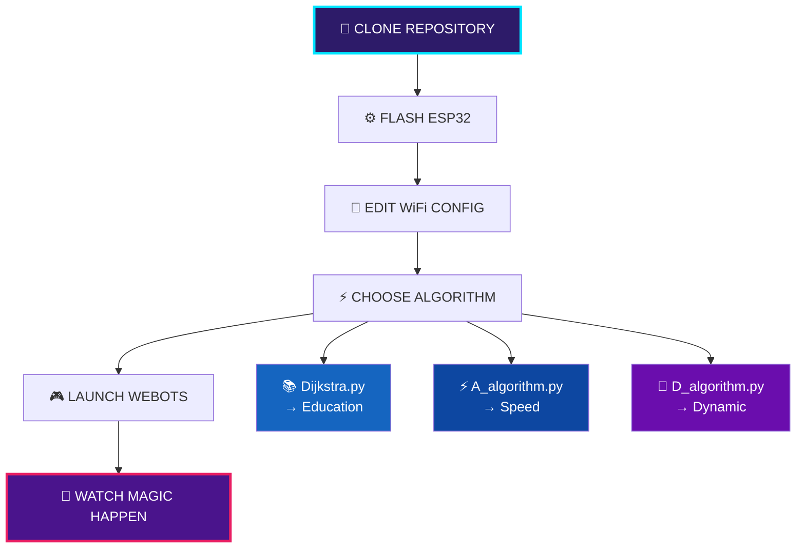
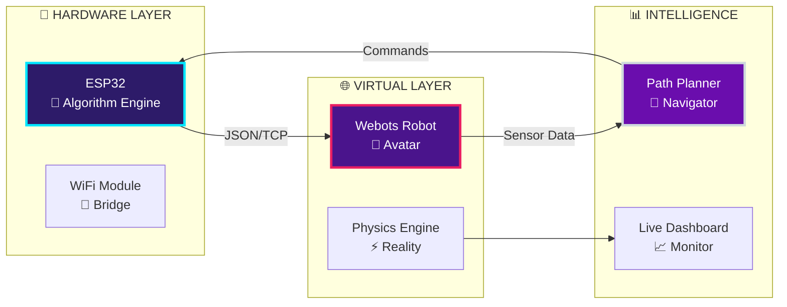
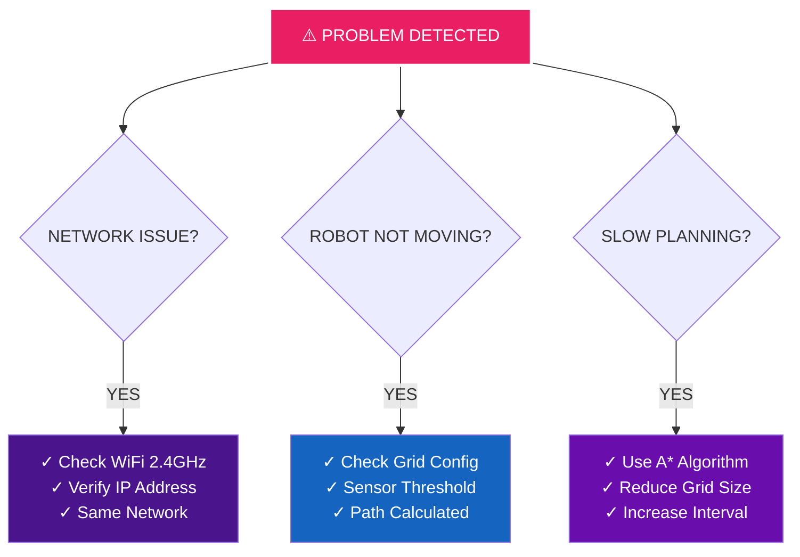
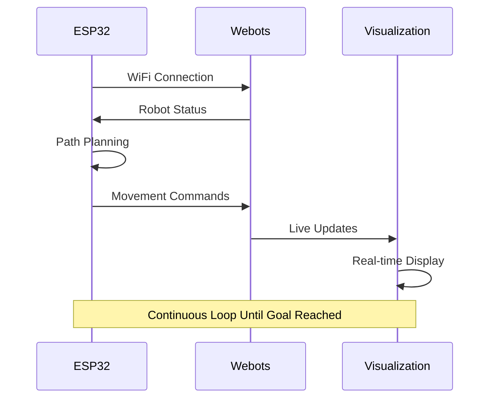

<div align="center">

# HARDWARE-IN-THE-LOOP NAVIGATION SYSTEM
    PLEASE DON'T COPY EVERYTHING AND HAND IT IN AS YOUR WORK, USE IT AS INSPIRATION


```ascii
╔══════════════════════════════════════════════════════════════╗
║                     REAL HARDWARE CONTROLS VIRTUAL ROBOT                    ║
║                                                              ║
║  ESP32 ←→ WiFi ←→ Webots  |  Live Pathfinding  |  Real-time HIL  ║
╚══════════════════════════════════════════════════════════════╝
```

## LIVE DEMONSTRATION

[](https://youtu.be/QRNA4Zo2aBg)

</div>

---

## ⚡ SYSTEM OVERVIEW

<table align="center" width="100%">
<tr>
<td width="50%" align="center">

### REAL HARDWARE
```
┌─────────────────┐
│     ESP32       │
│   BRAIN UNIT    │
│                 │
│ ▪ MicroPython   │
│ ▪ WiFi Stack    │
│ ▪ Path Planning │
│ ▪ Algorithms    │
└─────────────────┘
```

</td>
<td width="50%" align="center">

### VIRTUAL ENVIRONMENT
```
┌─────────────────┐
│     WEBOTS      │
│  SIMULATION     │
│                 │
│ ▪ Physics Eng   │
│ ▪ Sensors       │
│ ▪ Visualization │
│ ▪ Real-time     │
└─────────────────┘
```

</td>
</tr>
</table>

---

## 🧠 ALGORITHM ARSENAL

<table align="center">
<tr>
<td width="33%" align="center">

### DIJKSTRA CLASSIC
```
██████████████████████
█ GUARANTEED OPTIMAL █
██████████████████████
```
**Perfect Education Tool**
- 100% Optimal Paths
- O((V+E)log V) Complexity
- Educational Excellence
- `Dijkstra.py`

</td>
<td width="33%" align="center">

### A* LIGHTNING
```
████████████████
█ SPEED DEMON █
████████████████
```
**Heuristic Powerhouse**
- 3x Faster Planning
- Goal-Directed Search
- Memory Efficient
- `A_algorithm.py`

</td>
<td width="33%" align="center">

### D* LITE ADAPTIVE
```
████████████████████
█ DYNAMIC EVOLUTION █
████████████████████
```
**AI Learning System**
- Real-time Replanning
- Obstacle Adaptation
- Self-Improving
- `D_algorithm.py`

</td>
</tr>
</table>

---

## 🚀 QUICK START FLOWCHART



---

## ⚡ INSTALLATION MATRIX

<table align="center">
<tr>
<th>STEP</th>
<th>WINDOWS</th>
<th>MACOS</th>
<th>LINUX</th>
</tr>
<tr>
<td><strong>WEBOTS</strong></td>
<td>Download .exe → Install</td>
<td>Download .dmg → Drag</td>
<td><code>wget webots.deb</code></td>
</tr>
<tr>
<td><strong>PYTHON</strong></td>
<td><code>pip install matplotlib numpy</code></td>
<td><code>pip3 install matplotlib numpy</code></td>
<td><code>sudo apt install python3-pip</code></td>
</tr>
<tr>
<td><strong>ESP32</strong></td>
<td colspan="3" align="center">Flash MicroPython via Thonny IDE</td>
</tr>
</table>

---

## 🎯 SYSTEM ARCHITECTURE



---

## ⚙️ CONFIGURATION SIMPLIFIED

### ESP32 SETUP
```python
# EDIT YOUR CHOSEN ALGORITHM FILE
WIFI_SSID = 'Your_Network'
WIFI_PASSWORD = 'Your_Password'
# UPLOAD TO ESP32 AS main.py
```

### WEBOTS SETUP
```python
# EDIT: webots_controller/line_following_wifi_HIL.py
ESP32_IP_ADDRESS = "192.168.x.x"  # FROM ESP32 OUTPUT
```

---

## 🏆 PERFORMANCE MATRIX

<div align="center">

| ALGORITHM | SPEED | QUALITY | MEMORY | ADAPTABILITY |
|-----------|-------|---------|--------|--------------|
| **DIJKSTRA** | `█░░` | `███` | `███` | `░░░` |
| **A\*** | `███` | `███` | `█░░` | `░░░` |
| **D\* LITE** | `██░` | `██░` | `██░` | `███` |

</div>

---

## 🔧 TROUBLESHOOTING QUICK FIXES



---

## 🎮 PROJECT STRUCTURE

```
HIL-Navigation-System/
├── 🎬 demo.mp4                    # Live demonstration
├── 📸 track_layout.png            # Circuit layout
├── 🧠 esp32_code/
│   ├── ⚡ Dijkstra.py            # Optimal pathfinding
│   ├── 🚀 A_algorithm.py         # Speed-focused
│   └── 🧬 D_algorithm.py         # Adaptive learning
├── 🎮 webots_controller/
│   └── line_following_wifi_HIL.py # Universal controller
└── 🌍 world/
    └── RaFLite.wbt               # Simulation environment
```

---

## 🌟 ADVANCED FEATURES UNLOCKED

<table align="center">
<tr>
<td width="50%">

### REAL-TIME CAPABILITIES
- **Live Obstacle Detection**
- **Dynamic Path Replanning**  
- **Sensor Fusion Technology**
- **Hardware-Software Bridge**

</td>
<td width="50%">

### EDUCATIONAL POWER
- **Algorithm Comparison**
- **Performance Analytics**
- **Research Foundation**
- **Industry Applications**

</td>
</tr>
</table>

---

## 🎯 USAGE FLOW



---

<div align="center">

## POWER STATISTICS

```ascii
╔═══════════════════════════════════════════════════════════╗
║  🔮 ALGORITHMS: 3 Advanced Types  │  ⚡ PLANNING: Real-time  ║
║  🧠 ESP32 Brain: MicroPython      │  📡 COMMUNICATION: WiFi  ║  
║  🎯 NAVIGATION: Grid-based        │  📊 VISUALIZATION: Live  ║
╚═══════════════════════════════════════════════════════════╝
```

### LICENSE: MIT | CONTRIBUTE: GitHub | WATCH: Demo Above

**Where hardware transcends software limitations, intelligence emerges from silicon and code**

</div> 
