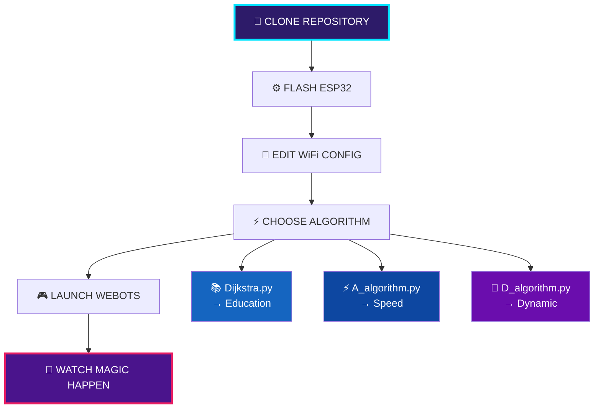
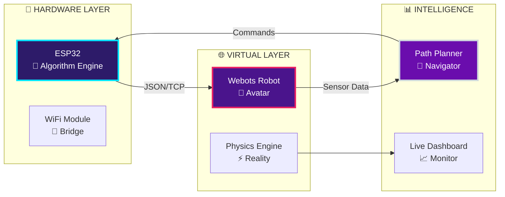
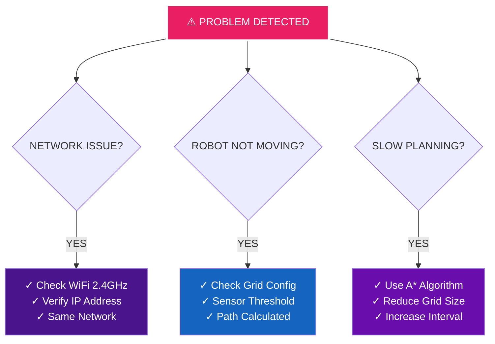
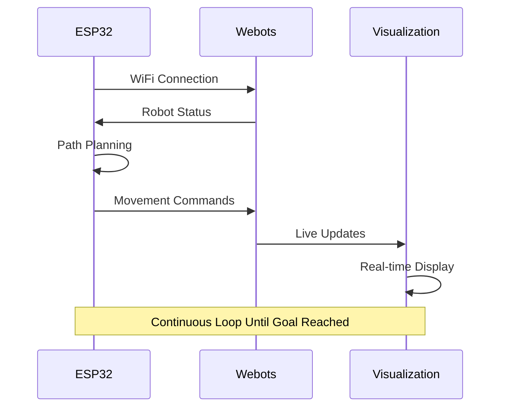

<div align="center">

# HARDWARE-IN-THE-LOOP NAVIGATION SYSTEM
    PLEASE DON'T COPY EVERYTHING AND HAND IT IN AS YOUR WORK, USE IT AS INSPIRATION
    IF IT DOES'T WORK FOR YOU EITHER BLAME YOUR LAPTOP OR WIFI AND MOVE ON

## LIVE DEMONSTRATION

[](https://youtu.be/QRNA4Zo2aBg)


# ESP32 MicroPython Project

<div align="center">


</div>

---

##  Tech Stack

| Component | Technology | Version |
|-----------|------------|---------|
| **IDE** | Thonny | 4.1.7 |
| **Firmware** | MicroPython | Latest |
| **Platform** | Linux | - | I USE ARCH BTW
| **Python** | Python | 3.12.10 |
| **GUI** | Tk | 8.6.15 |
|  **Simulator** | Webots | R2023a+ |

##  Project Features

<div align="center">

###  **ESP32 Development**
*Real-time embedded programming with MicroPython firmware*

### **Smart Algorithms** 
*Three different algorithm implementations for optimization*

###  **Simulation Ready**
*Full Webots integration for testing and validation*

###  **Live Development**
*Interactive coding with Thonny's powerful debugging tools*

</div>

## Quick Setup

```bash
# 1. Flash MicroPython firmware to ESP32
esptool.py --chip esp32 erase_flash
esptool.py --chip esp32 write_flash -z 0x1000 micropython.bin

# 2. Open Thonny IDE
# 3. Configure interpreter: Tools > Options > Interpreter
# 4. Select "MicroPython (ESP32)" and your COM port
# 5. Ready to code! 
```

##  Hardware Requirements

- 🔹 **ESP32** development board (DevKit v1 recommended)
- 🔹 USB cable for programming
- 🔹 Sensors/actuators as per project specs
- 🔹 Breadboard and jumper wires

## 💻 Software Dependencies

- 🔸 **Thonny IDE** 4.1.7+
- 🔸 **MicroPython firmware** for ESP32
- 🔸 **Webots** R2023a+ (simulation)
- 🔸 **esptool.py** (firmware flashing)

## Usage

### For ESP32 Development:
1. Connect your ESP32 to your computer
2. Open Thonny and select MicroPython (ESP32) interpreter
3. Load `main.py` and run directly on hardware
4. Monitor output in Thonny's shell

### For Simulation:
1. Open Webots R2023a+
2. Load the world file from `simulation/`
3. Run the simulation with your algorithms
4. Compare results with real hardware

## Contributing

Feel free to contribute to this project! Whether it's:
- Bug fixes
- New features  
- Documentation improvements
- Test cases

## License

This project is open source - feel free to use and modify!

---

<div align="center">


** If this project helped you, give it a star!**

</div>

---

*Developed with Thonny IDE - Made at the University of Tartu, Estonia*

```ascii
╔══════════════════════════════════════════════════════════════╗
║                     REAL HARDWARE CONTROLS VIRTUAL ROBOT     ║
║                                                              ║
║  ESP32 ←→ WiFi ←→ Webots  |  Live Pathfinding  |Real-time HIL║
╚══════════════════════════════════════════════════════════════╝
```


</div>

---

## ⚡ SYSTEM OVERVIEW

<table align="center" width="100%">
<tr>
<td width="50%" align="center">

### REAL HARDWARE
```
┌─────────────────┐
│     ESP32       │
│   BRAIN UNIT    │
│                 │
│ ▪ MicroPython   │
│ ▪ WiFi Stack    │
│ ▪ Path Planning │
│ ▪ Algorithms    │
└─────────────────┘
```

</td>
<td width="50%" align="center">

### VIRTUAL ENVIRONMENT
```
┌─────────────────┐
│     WEBOTS      │
│  SIMULATION     │
│                 │
│ ▪ Physics Eng   │
│ ▪ Sensors       │
│ ▪ Visualization │
│ ▪ Real-time     │
└─────────────────┘
```

</td>
</tr>
</table>

---

## 🧠 ALGORITHM ARSENAL

<table align="center">
<tr>
<td width="33%" align="center">

### DIJKSTRA CLASSIC
```
██████████████████████
█ GUARANTEED OPTIMAL █
██████████████████████
```
**Perfect Education Tool**
- 100% Optimal Paths
- O((V+E)log V) Complexity
- Educational Excellence
- `Dijkstra.py`

</td>
<td width="33%" align="center">

### A* LIGHTNING
```
████████████████
█ SPEED DEMON █
████████████████
```
**Heuristic Powerhouse**
- 3x Faster Planning
- Goal-Directed Search
- Memory Efficient
- `A_algorithm.py`

</td>
<td width="33%" align="center">

### D* LITE ADAPTIVE
```
████████████████████
█ DYNAMIC EVOLUTION █
████████████████████
```
**AI Learning System**
- Real-time Replanning
- Obstacle Adaptation
- Self-Improving
- `D_algorithm.py`

</td>
</tr>
</table>

---

## 🚀 QUICK START FLOWCHART



---

## ⚡ INSTALLATION MATRIX

<table align="center">
<tr>
<th>STEP</th>
<th>WINDOWS</th>
<th>MACOS</th>
<th>LINUX</th>
</tr>
<tr>
<td><strong>WEBOTS</strong></td>
<td>Download .exe → Install</td>
<td>Download .dmg → Drag</td>
<td><code>wget webots.deb</code></td>
</tr>
<tr>
<td><strong>PYTHON</strong></td>
<td><code>pip install matplotlib numpy</code></td>
<td><code>pip3 install matplotlib numpy</code></td>
<td><code>sudo apt install python3-pip</code></td>
</tr>
<tr>
<td><strong>ESP32</strong></td>
<td colspan="3" align="center">Flash MicroPython via Thonny IDE</td>
</tr>
</table>

---

## 🎯 SYSTEM ARCHITECTURE



---

## ⚙️ CONFIGURATION SIMPLIFIED

### ESP32 SETUP
```python
# EDIT YOUR CHOSEN ALGORITHM FILE
WIFI_SSID = 'Your_Network'
WIFI_PASSWORD = 'Your_Password'
# UPLOAD TO ESP32 AS main.py
```

### WEBOTS SETUP
```python
# EDIT: webots_controller/line_following_wifi_HIL.py
ESP32_IP_ADDRESS = "192.168.x.x"  # FROM ESP32 OUTPUT
```

---

## 🏆 PERFORMANCE MATRIX

<div align="center">

| ALGORITHM | SPEED | QUALITY | MEMORY | ADAPTABILITY |
|-----------|-------|---------|--------|--------------|
| **DIJKSTRA** | `█░░` | `███` | `███` | `░░░` |
| **A\*** | `███` | `███` | `█░░` | `░░░` |
| **D\* LITE** | `██░` | `██░` | `██░` | `███` |

</div>

---

## 🔧 TROUBLESHOOTING QUICK FIXES



---

## 🎮 PROJECT STRUCTURE

```
HIL-Navigation-System/
├── 🎬 demo.mp4                    # Live demonstration
├── 📸 track_layout.png            # Circuit layout
├── 🧠 esp32_code/
│   ├── ⚡ Dijkstra.py            # Optimal pathfinding
│   ├── 🚀 A_algorithm.py         # Speed-focused
│   └── 🧬 D_algorithm.py         # Adaptive learning
├── 🎮 webots_controller/
│   └── line_following_wifi_HIL.py # Universal controller
└── 🌍 world/
    └── RaFLite.wbt               # Simulation environment
```

---

## 🌟 ADVANCED FEATURES UNLOCKED

<table align="center">
<tr>
<td width="50%">

### REAL-TIME CAPABILITIES
- **Live Obstacle Detection**
- **Dynamic Path Replanning**  
- **Sensor Fusion Technology**
- **Hardware-Software Bridge**

</td>
<td width="50%">

### EDUCATIONAL POWER
- **Algorithm Comparison**
- **Performance Analytics**
- **Research Foundation**
- **Industry Applications**

</td>
</tr>
</table>

---

## 🎯 USAGE FLOW



---

<div align="center">

## POWER STATISTICS

```ascii
╔═══════════════════════════════════════════════════════════╗
║  🔮 ALGORITHMS: 3 Advanced Types  │  ⚡ PLANNING: Real-time  ║
║  🧠 ESP32 Brain: MicroPython      │  📡 COMMUNICATION: WiFi  ║  
║  🎯 NAVIGATION: Grid-based        │  📊 VISUALIZATION: Live  ║
╚═══════════════════════════════════════════════════════════╝
```

### LICENSE: MIT | CONTRIBUTE: GitHub | WATCH: Demo Above

**Where hardware transcends software limitations, intelligence emerges from silicon and code**

</div> 
