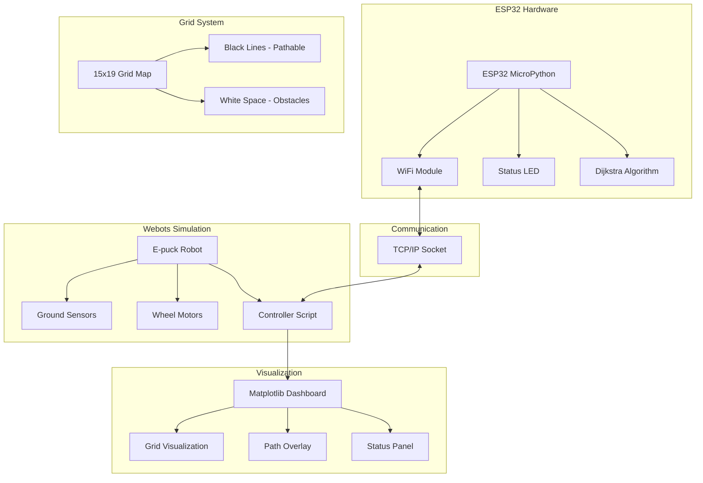

<div align="center">

# 🤖 Hardware-in-the-Loop (HIL) Robot Navigation System

[](https://www.python.org/downloads/)
[](https://cyberbotics.com/)
[](https://micropython.org/)
[](https://opensource.org/licenses/MIT)
[]()

*Advanced robotic navigation combining real hardware control with virtual simulation environments*

[Features](#-features) • [Quick Start](#-quick-start) • [Architecture](#-system-architecture) • [Installation](#-installation) • [Documentation](#-documentation)

</div>

---

## 🌟 Overview

This project demonstrates a sophisticated **Hardware-in-the-Loop (HIL)** simulation system where an **ESP32 microcontroller** (running MicroPython) intelligently controls a virtual **Webots robot** through Wi-Fi communication. The system features advanced **Dijkstra path planning**, real-time **sensor-based navigation**, and dynamic **grid mapping** with visual feedback.

### 🎯 Key Highlights

- **🔗 Seamless HIL Integration**: Real ESP32 hardware controlling virtual Webots robot
- **🧭 Smart Path Planning**: Dijkstra's algorithm for optimal route calculation
- **📡 Wireless Communication**: Robust TCP/IP over Wi-Fi with JSON messaging
- **👁️ Real-time Visualization**: Live matplotlib dashboard with sensor feedback
- **🎮 Adaptive Control**: Finite State Machine (FSM) for navigation logic
- **⚡ Sensor Fusion**: Ground sensor integration for line-following precision

---

## ✨ Features

### 🚀 Core Capabilities
| Feature | Description |
|---------|-------------|
| **HIL Simulation** | ESP32 remotely controls Webots robot simulation |
| **Path Planning** | Dijkstra's algorithm for shortest path computation |
| **Wireless Control** | Wi-Fi TCP/IP communication with JSON protocols |
| **Real-time Mapping** | Live grid visualization with sensor overlay |
| **Line Following** | Precision ground sensor-based navigation |
| **State Management** | Robust FSM for turn sequences and movement |

### 🎛️ Advanced Features
- **Dynamic Grid Calibration**: Automatic coordinate system alignment
- **Sensor Mismatch Detection**: Real-time validation between expected and actual sensor readings
- **Visual Debugging**: Comprehensive matplotlib-based monitoring dashboard
- **Fault Tolerance**: Automatic reconnection and error recovery
- **Performance Monitoring**: Live telemetry and status reporting

---

## 🏗️ System Architecture



### 📊 Data Flow

```
ESP32 Sensors → Path Planning → Command Generation → WiFi Transmission 
     ↓
Webots Receives → Motor Control → Sensor Reading → Position Update
     ↓
Telemetry Feedback → Visualization Update → Grid Position Validation
     ↓
Loop Continues...
```

---

## 🚀 Quick Start

### ⚡ 1-Minute Setup

```bash
# 1. Clone the repository
git clone https://github.com/yourusername/HIL-Robot-Navigation.git
cd HIL-Robot-Navigation

# 2. Configure ESP32 WiFi (edit esp32_code/main.py)
WIFI_SSID = 'Your_Network_Name'
WIFI_PASSWORD = 'Your_Password'

# 3. Flash ESP32 and run simulation
# Upload main.py to ESP32 → Open Webots → Load RaFLite.wbt → Start simulation
```

### 🎬 Demo Video
> *The robot navigates from start (0,18) to goal (14,0) using optimal path planning*

---

## 🛠️ Installation

### 📋 Prerequisites

| Component | Version | Purpose |
|-----------|---------|---------|
| **Webots** | R2023a+ | Robot simulation environment |
| **Python** | 3.7+ | Controller scripts and visualization |
| **MicroPython** | Latest | ESP32 firmware |
| **ESP32** | Any variant | Hardware controller |

### 🔧 Hardware Setup

```yaml
Required Hardware:
  - ESP32 Development Board
  - Computer with Webots installed
  - WiFi Network (2.4GHz recommended)
  - USB Cable for ESP32 programming

Optional:
  - External LED indicators
  - Serial monitor for debugging
```

### 💻 Software Installation

#### Step 1: Webots Environment
```bash
# Download Webots from https://cyberbotics.com/
# Install Python dependencies
pip install matplotlib numpy json socket
```

#### Step 2: ESP32 Setup
```python
# Flash MicroPython to ESP32
# Upload esp32_code/main.py using Thonny IDE or ampy
```

#### Step 3: Configuration
```python
# Edit esp32_code/main.py
WIFI_SSID = 'YourNetwork'
WIFI_PASSWORD = 'YourPassword'

# Edit webots_controller/line_following_wifi_HIL.py  
ESP32_IP_ADDRESS = "192.168.x.x"  # ESP32's IP address
```

---

## ⚙️ Configuration

### 🎚️ Key Parameters

#### **ESP32 Configuration** (`main.py`)
```python
# Network Settings
WIFI_SSID = 'Your_WiFi_Network'
WIFI_PASSWORD = 'Your_Password'
SERVER_PORT = 8080

# Grid Configuration (15x19 maze)
GRID_ROWS = 15
GRID_COLS = 19
# 0 = Black Line (navigable), 1 = White Space (obstacle)

# Path Planning
REPLAN_INTERVAL_MS = 1000  # Path recalculation frequency
ANGLE_THRESHOLD_RAD = 40°  # Turning sensitivity
```

#### **Webots Configuration** (`line_following_wifi_HIL.py`)
```python
# Robot Physics
WHEEL_RADIUS = 0.0205      # E-puck wheel radius (m)
AXLE_LENGTH = 0.0610       # Distance between wheels (m)
FORWARD_SPEED = 1.8        # Base movement speed

# Grid Mapping
GRID_CELL_SIZE = 0.057     # Physical size of each grid cell (m)
GRID_ORIGIN_X = -0.3       # World X coordinate of grid (0,0)
GRID_ORIGIN_Z = 0.0        # World Z coordinate of grid (0,0)

# Sensor Calibration
LINE_THRESHOLD = 600       # Ground sensor threshold for line detection
```

### 🎯 Grid Calibration

The system uses a **15×19 grid** representing the navigation environment:

```
Grid Layout (0,0 = bottom-left):
- Black cells (0): Navigable paths
- White cells (1): Obstacles
- Start position: (0, 18)
- Goal position: (14, 0)
```

#### Calibration Process:
1. **Enable Debug Mode**: Set `CALIBRATION_MODE = True` in controller
2. **Verify Coordinates**: Check grid cell coordinates match physical positions
3. **Adjust Parameters**: Fine-tune `GRID_ORIGIN_X`, `GRID_ORIGIN_Z`, and `GRID_CELL_SIZE`
4. **Validate Alignment**: Ensure robot position matches grid expectations

---

## 🎮 Usage

### 🏁 Running the Simulation

#### **Method 1: Standard Operation**
```bash
1. Power on ESP32 → Connect to WiFi → Note IP address
2. Update ESP32_IP_ADDRESS in Webots controller
3. Open Webots → Load world/RaFLite.wbt
4. Start simulation → Connection established automatically
5. Watch robot navigate from start to goal
```

#### **Method 2: Debug Mode**
```python
# Enable detailed logging in both files:
DEBUG_MODE = True           # In ESP32 main.py
VERBOSE_LOGGING = True      # In Webots controller
```

### 📊 Monitoring Dashboard

The real-time visualization provides:

- **🗺️ Grid Map**: Visual representation of the navigation environment
- **📍 Robot Position**: Current location with orientation arrow
- **🛤️ Planned Path**: Dijkstra-calculated optimal route
- **📡 Sensor Status**: Ground sensor readings and line detection
- **⚠️ Mismatch Alerts**: Warnings when sensors don't match grid expectations
- **📈 Telemetry**: Speed, orientation, and system status

---

## 🔧 Troubleshooting

### 🚨 Common Issues

| Issue | Symptoms | Solution |
|-------|----------|----------|
| **WiFi Connection Failed** | ESP32 LED blinking rapidly | Check SSID/password, ensure 2.4GHz network |
| **Robot Off Grid** | Position mismatch warnings | Calibrate `GRID_ORIGIN_X/Z` and `GRID_CELL_SIZE` |
| **Sensor Mismatch** | "Robot on white but sensors detect line" | Adjust `LINE_THRESHOLD` value (typically 100-300 for black) |
| **Path Planning Fails** | No path found messages | Verify start/goal positions are on black lines (grid value = 0) |
| **Erratic Movement** | Robot spinning or oscillating | Tune `TURN_SPEED_FACTOR` and correction differentials |

### 🔍 Debug Commands

```python
# ESP32 Serial Monitor
print(f"Robot at grid {current_robot_grid_pos_actual}, goal {goal_grid_pos}")
print(f"Path: {planned_path}")

# Webots Console  
print(f"Sensor readings: {[s.getValue() for s in gs_wb]}")
print(f"Grid position: {world_to_grid(rwp['x'], rwp['z'])}")
```

### 📞 Support Checklist

- [ ] ESP32 connected to WiFi (solid LED)
- [ ] IP addresses match in both files
- [ ] Grid maps identical in ESP32 and Webots
- [ ] Sensor threshold appropriate for surface
- [ ] Robot starting position on black line

---

## 🎨 Customization

### 🗺️ Creating Custom Maps

```python
# Edit the world_grid array in both files:
world_grid = [
    [1,1,1,1,1,1,1,1,1,1,1,1,0,1,0,1,0,1,0],  # Row 0
    [0,0,0,0,0,0,0,0,0,0,0,0,0,0,0,0,0,0,0],  # Row 1
    # ... define your custom layout
]

# 0 = Black line (robot can travel)
# 1 = White space (obstacle)
```

### 🎯 Changing Start/Goal Positions

```python
# In Webots controller:
INITIAL_GRID_ROW = 0    # Starting row
INITIAL_GRID_COL = 18   # Starting column
GOAL_ROW = 14           # Destination row  
GOAL_COL = 0            # Destination column
```

### ⚡ Performance Tuning

```python
# Speed adjustments:
FORWARD_SPEED = 1.8              # Base movement speed
TURN_SPEED_FACTOR = 0.8          # Turning speed multiplier
REPLAN_INTERVAL_MS = 1000        # Path recalculation frequency

# Sensor sensitivity:
LINE_THRESHOLD = 600             # Adjust based on surface reflectance
ANGLE_THRESHOLD_RAD = 40°        # Turning precision
```

---

## 📚 Technical Documentation

### 🧮 Algorithms

#### **Dijkstra Path Planning**
- **Complexity**: O((V + E) log V) where V = grid cells, E = connections
- **Implementation**: Custom priority queue for MicroPython compatibility
- **Features**: Dynamic replanning, obstacle avoidance, optimal path guarantee

#### **Line Following Control**
```python
# Sensor-based steering logic:
if center_sensor:                    # On line
    speed = base_speed
elif left_sensor:                    # Drifting right
    left_speed -= correction_differential
elif right_sensor:                   # Drifting left  
    right_speed -= correction_differential
```

#### **State Machine Architecture**
```
States: IDLE → PLANNING → TURNING → MOVING → ADJUSTING → GOAL_REACHED
Transitions based on: sensor feedback, path progress, error conditions
```

### 📡 Communication Protocol

#### **Message Format (JSON)**
```json
{
  "type": "webots_status",
  "robot_grid_pos": [row, col],
  "goal_grid_pos": [goal_row, goal_col],
  "world_pose": {
    "x": 0.123,
    "z": 0.456, 
    "theta_rad": 1.571
  },
  "sensors_binary": [0, 1, 0]
}
```

#### **Command Responses**
```json
{
  "type": "esp32_command",
  "action": "forward|turn_left|turn_right|stop",
  "path": [[r1,c1], [r2,c2], ...],
  "robot_pos_on_path_esp_thinks": [row, col],
  "current_path_idx_esp": 5
}
```

---

## 🔮 Future Enhancements

### 🚀 Planned Features

- [ ] **Multi-Robot Coordination**: Support for multiple ESP32-controlled robots
- [ ] **Obstacle Detection**: Dynamic obstacle avoidance with sensor fusion  
- [ ] **Web Interface**: Browser-based control and monitoring dashboard
- [ ] **Machine Learning**: Neural network-based path optimization
- [ ] **Real Hardware**: Physical robot implementation with same codebase
- [ ] **Cloud Integration**: Remote monitoring and control via IoT platforms

### 🎯 Enhancement Ideas

- **Advanced Sensors**: Camera integration for visual navigation
- **Swarm Behavior**: Coordinated multi-robot missions
- **Voice Control**: Speech recognition for goal selection
- **AR Visualization**: Augmented reality overlay for real robot tracking
- **Performance Analytics**: Detailed metrics and optimization suggestions

---

## 🤝 Contributing

We welcome contributions! Here's how to get involved:

### 🛠️ Development Setup
```bash
git clone https://github.com/yourusername/HIL-Robot-Navigation.git
cd HIL-Robot-Navigation
git checkout -b feature/your-feature-name
```

### 📝 Contribution Guidelines
- Follow PEP 8 style guidelines for Python code
- Add comprehensive docstrings and comments
- Test thoroughly on both ESP32 and Webots
- Update documentation for new features
- Submit detailed pull requests

### 🐛 Reporting Issues
- Use the GitHub issue tracker
- Include system specifications (Webots version, ESP32 model, OS)
- Provide detailed reproduction steps
- Attach relevant log files and screenshots

---

## 📄 License

This project is licensed under the **MIT License** - see the [LICENSE](LICENSE) file for details.

### 📖 Attribution
- **Webots**: Robot simulation platform by Cyberbotics
- **E-puck**: Robot model from EPFL
- **MicroPython**: Python implementation for microcontrollers

---

## 🎓 Educational Resources

### 📚 Learning Materials
- [Dijkstra's Algorithm Explained](https://en.wikipedia.org/wiki/Dijkstra%27s_algorithm)
- [Hardware-in-the-Loop Testing](https://en.wikipedia.org/wiki/Hardware-in-the-loop_simulation)
- [Webots Documentation](https://cyberbotics.com/doc/guide/index)
- [ESP32 MicroPython Guide](https://docs.micropython.org/en/latest/esp32/quickref.html)

### 🎯 Applications
- **Robotics Education**: Learn path planning and control systems
- **IoT Development**: Understand wireless communication protocols
- **Research Projects**: Foundation for advanced navigation research
- **Industrial Applications**: Warehouse automation and logistics

---

<div align="center">

## 🌟 Acknowledgments

Special thanks to the open-source robotics community and all contributors who made this project possible.

---

**Built with ❤️ for the robotics community**

*If this project helped you, please consider giving it a ⭐ on GitHub!*

[⬆ Back to Top](#-hardware-in-the-loop-hil-robot-navigation-system)

</div>
